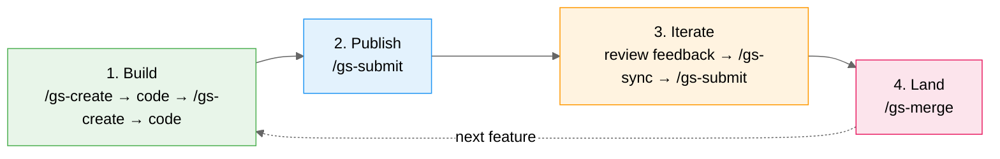
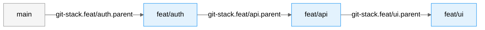
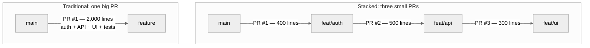
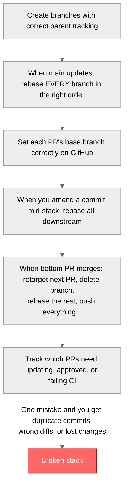

# claude-ghstack

A [Claude Code](https://claude.ai/code) plugin for stacked PR management. Ship large features as small, reviewable PRs — without the git headaches.

Stacked PRs split a big change into a chain of small, dependent pull requests that build on each other. claude-ghstack handles the branching, rebasing, PR creation, and cleanup so you don't have to.

## Table of contents

- [Installation](#installation)
- [What claude-ghstack does](#what-claude-ghstack-does)
- [How it works](#how-it-works)
- [Why stacked PRs?](#why-stacked-prs)
- [Comparison with other tools](#comparison-with-other-tools)
- [Troubleshooting](#troubleshooting)
- [Contributing](#contributing)
- [License](#license)

## Installation

### Prerequisites

- [Claude Code](https://claude.ai/code)
- [GitHub CLI (`gh`)](https://cli.github.com/) — required for network commands (`/gs-submit`, `/gs-sync`, `/gs-merge`, `/gs-log`). Local commands work without it.

### Via plugin marketplace (recommended)

```bash
# Add the marketplace (one-time)
/plugin marketplace add tbekaert/claude-ghstack

# Install the plugin
/plugin install claude-ghstack@tbekaert-plugins
```

### For teams

Add to your repo's `.claude/settings.json` so the plugin is available for all collaborators:

```json
{
  "extraKnownMarketplaces": {
    "tbekaert-plugins": {
      "source": { "source": "github", "repo": "tbekaert/claude-ghstack" }
    }
  },
  "enabledPlugins": {
    "claude-ghstack@tbekaert-plugins": true
  }
}
```

### Manual

Copy (or symlink) this directory into your project's `.claude/plugins/` folder:

```bash
cp -r claude-ghstack /your/project/.claude/plugins/claude-ghstack
```

### Verify

Run `/gs-help` to verify the plugin is active.

## What claude-ghstack does

claude-ghstack provides eight slash commands that handle the entire stacked PR lifecycle. Local commands work offline; network commands require the [GitHub CLI](https://cli.github.com/).

| Command      | Description                                                                 |
| ------------ | --------------------------------------------------------------------------- |
| `/gs-create` | Create a new branch stacked on the current one, stage changes, and commit   |
| `/gs-insert` | Insert a new branch at a chosen position in an existing stack               |
| `/gs-move`   | Reorder a branch (move up/down/to position) or detach it from the stack     |
| `/gs-submit` | Push all branches and create/update PRs on GitHub with proper base branches |
| `/gs-sync`   | Rebase the entire stack after upstream changes, optionally push             |
| `/gs-merge`  | Merge approved PRs into `main` with automatic retarget, cleanup, and rebase |
| `/gs-log`    | Display the stack graph with PR status, CI checks, and review state         |
| `/gs-help`   | Show the quick reference card                                               |

### Typical workflow



### Example session

```bash
# You're on main. Start a new stack.
/gs-create "feat(auth): add token refresh endpoint"

# Creates branch feat/auth, commits your staged changes.
# Stack: main → feat/auth

# Keep building. Create the next layer.
/gs-create "feat(api): add user profile endpoint"

# Stack: main → feat/auth → feat/api

# One more layer.
/gs-create "feat(ui): add profile settings page"

# Stack: main → feat/auth → feat/api → feat/ui

# Check your stack.
/gs-log

#   main
#     ↓
#   feat/auth (not published) 1 commit
#     ↓
#   feat/api (not published) 1 commit
#     ↓
# ● feat/ui (not published) 1 commit  ← you are here

# Publish everything.
/gs-submit

# Creates 3 PRs:
#   PR #1: feat/auth        base: main
#   PR #2: feat/api         base: feat/auth
#   PR #3: feat/ui          base: feat/api

# Main moved forward while you were working. Sync.
/gs-sync

# Rebases the entire chain onto origin/main, in order.
# Optionally pushes updated branches.

# PR #1 got approved. Merge it.
/gs-merge

# Merges PR #1, retargets PR #2 to main, deletes feat/auth,
# rebases remaining branches, pushes everything.
```

## How it works

Stack metadata is stored in `.git/config` under `git-stack.*` keys — no extra files to commit or track. Each branch records its parent, forming a linked list:



Each command reads the stack state by following these parent pointers, performs its operation, and updates the config. The chain is walked bottom-up (closest to `main` first) for rebasing and submitting, ensuring each branch is always based on the correct parent.

### Key design decisions

- **No files to commit** — All state lives in `.git/config`, which is local and not tracked by git. Your repo stays clean.
- **Idempotent** — Running `/gs-submit` twice with no local changes is a no-op. Running `/gs-sync` when already up-to-date does nothing.
- **Safe by default** — All pushes use `--force-with-lease` (never bare `--force`). Genuine rebase conflicts always pause for manual resolution. Sensitive files are flagged before staging.
- **PR chain fallback** — If `git-stack.*` config is missing (e.g., branches were created outside the plugin), network commands reconstruct the stack by walking the GitHub PR chain.
- **Respects project conventions** — Branch names, commit messages, and PR titles follow patterns from your `CLAUDE.md` and existing history.

## Why stacked PRs?

Large features are hard to review as a single pull request. A 2,000-line diff often gets rubber-stamped or endlessly delayed. Stacked PRs solve this by splitting work into a chain of small, focused PRs that build on each other:



Each PR in the stack has a clear scope, is easy to review independently, and merges into the one below it (not directly into `main`). When the bottom PR merges, the next one retargets to `main` automatically.

### Benefits

- **Faster reviews** — Reviewers see small, focused diffs instead of a monolith. Review quality tends to drop sharply with larger diffs.
- **Unblocked development** — Start the next piece of work while the previous PR is in review. No waiting.
- **Cleaner history** — Each PR tells a coherent story: "add auth", "add API that uses auth", "add UI that calls API".
- **Easier reverts** — If something breaks, you revert one small PR, not the entire feature.
- **Parallel review** — Multiple team members can review different parts of the stack simultaneously.

### The problem with stacked PRs

Stacked PRs are powerful but painful to manage manually:



This is exactly what claude-ghstack automates.

## Comparison with other tools

There are several tools for managing stacked PRs. Here's how they compare:

| Tool | Approach | GitHub | GitLab | Free & OSS | Key trade-off |
|---|---|---|---|---|---|
| **claude-ghstack** | Claude Code plugin (AI-assisted) | Yes | No | Yes (MIT) | AI-native but requires Claude Code |
| [**Graphite**](https://graphite.com) | CLI + SaaS dashboard | Yes | No | CLI free, dashboard paid | Most polished UX, but proprietary and vendor lock-in |
| [**git-town**](https://www.git-town.com) | Git extension (Go) | Yes | Yes | Yes (MIT) | Broadest platform support, but broader scope than just stacking |
| [**ghstack**](https://github.com/ezyang/ghstack) | Python CLI (Meta-style) | Yes | No | Yes (MIT) | Clean commit=PR model, but can't merge via GitHub UI |
| [**spr**](https://github.com/ejoffe/spr) | Go CLI (Shopify) | Yes | No | Yes (MIT) | Simplest workflow, but combines commits on merge |
| [**git-branchless**](https://github.com/arxanas/git-branchless) | Rust Git toolkit | Pushes only | No | Yes (Apache-2.0) | Most powerful git extension, but stacking is secondary |
| [**git-machete**](https://github.com/VirtusLab/git-machete) | Python CLI + IntelliJ plugin | Yes | Yes | Yes (MIT) | Good visualization and GitLab support, no web UI |
| [**Aviator**](https://github.com/aviator-co/av) | Go CLI + SaaS | Yes | No | CLI free (MIT), SaaS paid | Includes merge queue, but full value needs paid plan |

### What makes claude-ghstack different

Most stacked PR tools are standalone CLIs that you learn alongside git. claude-ghstack takes a different approach: it's a set of skills that run inside Claude Code. Instead of memorizing new CLI commands, you describe what you want in natural language and the AI handles the git plumbing.

**Conversational workflow** — You don't need to learn a new CLI. `/gs-create` asks you to confirm the branch name and commit message. `/gs-merge` walks you through CI checks, unresolved reviews, and merge strategy. The AI adapts to your project's conventions.

**Convention-aware** — claude-ghstack reads your `CLAUDE.md` and existing branch/commit patterns to suggest branch names, commit messages, and PR titles that match your team's style. Other tools use fixed formats.

**Conflict resolution with guidance** — When a rebase conflict occurs, other tools drop you into a raw `git rebase` conflict state. claude-ghstack shows you exactly which files conflict, waits for you to resolve them, and continues the rebase — all within the conversation.

**Zero installation footprint** — No binary to install, no PATH to configure, no shell completions to set up. It's markdown files that Claude Code reads as skills. Stack metadata lives in `.git/config` with no extra files to commit.

**Trade-offs** — claude-ghstack requires Claude Code (it won't work in a plain terminal). It's GitHub-only. It doesn't have a web dashboard or merge queue. If you need GitLab support, look at git-town or git-machete. If you want a standalone CLI with no AI dependency, spr or git-town are excellent choices.

## Troubleshooting

### "The `gh` CLI is required"
Install the GitHub CLI from [cli.github.com](https://cli.github.com/), then authenticate with `gh auth login`.

### "`gh` is not authenticated"
Run `gh auth login` and follow the prompts to connect your GitHub account.

### "Working tree is dirty"
Network commands require a clean working tree. Commit or stash your changes first, or use `/gs-create` to start a new stack branch with your current changes.

### "No stack found"
You're on a branch with no `git-stack.*` metadata. Use `/gs-create` to start a new stack, or switch to a branch that belongs to an existing stack.

## Contributing

Bug reports and feature requests are welcome on [GitHub Issues](https://github.com/tbekaert/claude-ghstack/issues).

## License

MIT
